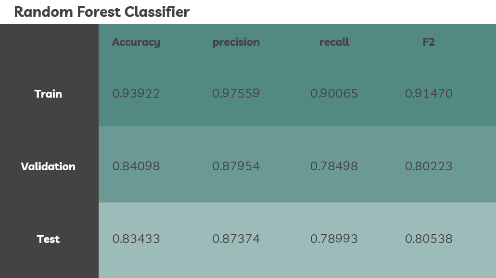
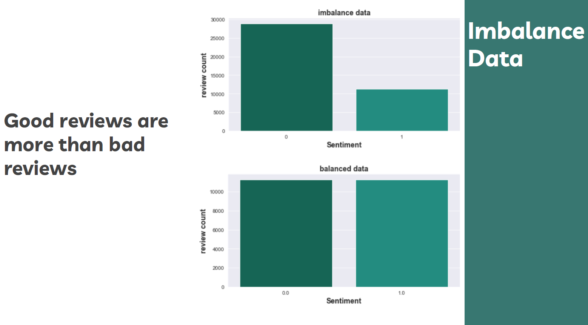
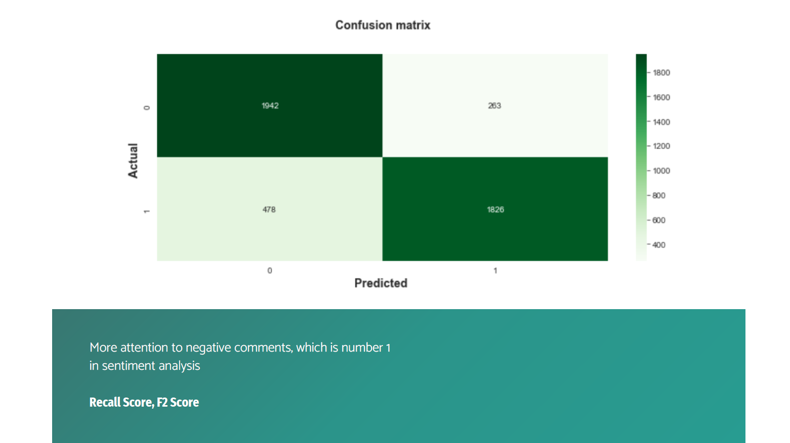
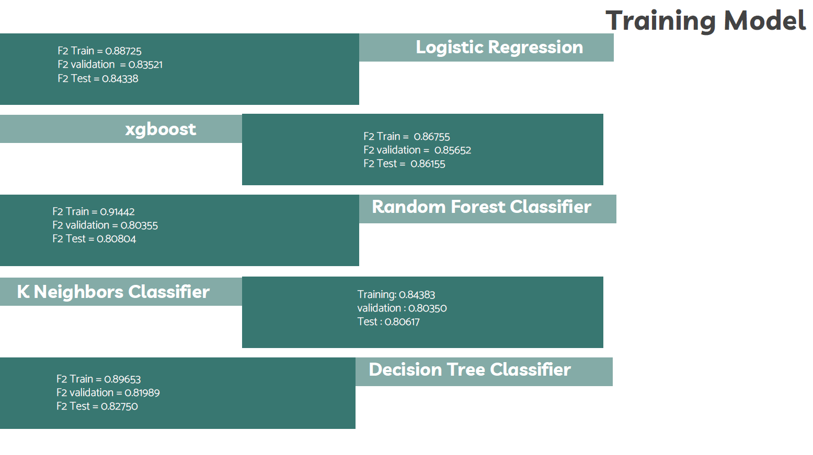

# Classification Final Delivrable

Fahad Ali Alharbi.

Email/Github: Fa7adBinA@gmail.com

## Abstract

The goal of this project was to use linear classification models to predict the sentiment for tawakkalna reviews from Apple store and Google play store, by scraping the reviews available in the Tawakkalna application on the Apple Store and Google Play Store and converting the words into a frequency for each word and deleting the extra words "stop word" in order not to be affected the Models with these words by using the most experience to convert words to frequence such as tf-idf and countvectorizer and try it with more than one model

## Design

* Company info:

Tawakkalna is a Saudi application to serve citizens and residents by knowing official documents and performing some government services.

* Value for the company:

The value of the project for the Tawakkalna application is to know the customers impression through the comments available for the application in the Apple Store and Google Play Store to develop application services.

## Data
Data obtained from [Tawakkalna Google Play Store](https://play.google.com/store/apps/details?id=sa.gov.nic.tawakkalna&hl=en&gl=US) and [Tawakkalna Apple Store](https://apps.apple.com/sa/app/tawakkalna-covid-19-ksa/id1506236754).

## Field Description:
rating	Review	date	userName	sentiment	

| Field Name        | Description                                                                     |
|-------------------|---------------------------------------------------------------------------------|
| Date              | Represents the date                                                             |
| Rating            | Rating from customer                                                            |
| Review            | Review written from customer                                                    |
| userName          | User name for customer                                                          |
| sentiment         | Sentiment for review                                                            |

* Data size more than one Year from APR 2020 to SEP 2021 for each dataset

* the total number of rows is 43403, and the total number of columns is 10

## Algorithms

#### Data Scraping:-
* google play scraper library and app store scraper library to scrape reviews from each store

#### Data Cleaning:-
* deep_translator library to translate non english reviews
* drop duplicate rows
* drop nulls, Spaces, emojis, numbers
* Drop columns not needed 

#### Classification  Model:-
* Logistic Regression library 
* metrics such as accuracy_score, F1 score, recall, precision, fbeta_score,precision_recall_curve
* Decision Tree Classifier
* xgboost
* RandomForestClassifier
* GridSearchCV
* KNeighborsClassifier
* The target variable is sentiment
* The best model is shown below

## Tools:
* Technologies: python, Jupyter notebook.
* Libraries: Numpy, Pandas, Matplotlib, Seaborn, Regex, Sklearn, google_play_scraper, app_store_scraper, deep_translator , langdetect , wordcloud ,eli5, xgboost

## Communication

